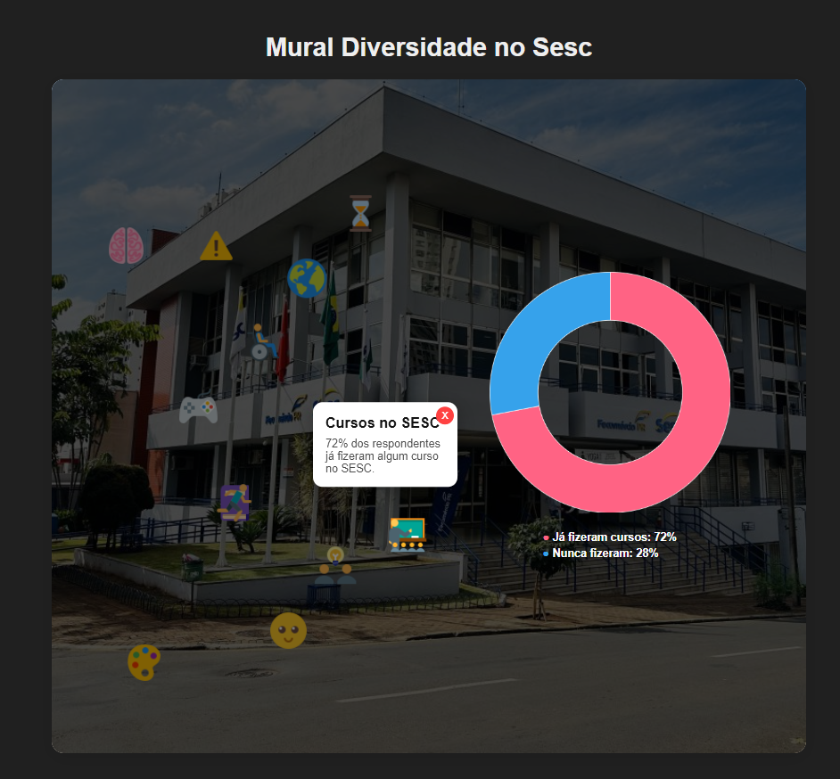

# 🏳️‍🌈 Mural Diversidade no SESC

Um projeto visual e interativo criado para exibir dados sobre diversidade, crenças, hábitos e perfis dos alunos do SESC. A interface mostra ícones distribuídos sobre um mural, e ao clicar neles, exibe informações e um gráfico em formato doughnut com dados percentuais relacionados ao tema.

## 📸 Prévia

## 🚀 Funcionalidades

- Mapa com ícones temáticos interativos.
- Cartões com informações explicativas e botão de fechar.
- Gráficos tipo "doughnut" atualizados dinamicamente com base no ícone clicado.
- Layout responsivo com design escuro e moderno.
- Dados ilustrando aspectos como:
  - Personalidade
  - Jogos
  - Nacionalidade
  - Leitura
  - Atividade física
  - Crenças religiosas
  - Identidade LGBT+
  - Tempo no SESC
  - Felicidade
  - Preconceito
  - Subcultura
  - Entre outros...

## 🛠️ Tecnologias Utilizadas

- HTML5
- CSS3 (modo escuro e responsivo)
- JavaScript (DOM + lógica de gráficos)
- Chart.js (https://www.chartjs.org/) para geração dos gráficos

## 📁 Estrutura de Arquivos

📦 mural-diversidade  
├── index.html         → Estrutura principal do projeto  
├── style.css          → Estilos do mural e dos ícones  
├── script.js          → Lógica JS (gráficos + interações)  
├── sesc.jpg           → Imagem de fundo do mural  
└── README.md          → Documentação do projeto  

## ✅ Como Executar

1. Clone o repositório:
   git clone https://github.com/seu-usuario/mural-diversidade.git
   cd mural-diversidade

2. Abra o arquivo `index.html` no navegador (duplo clique ou via Live Server)

> Não é necessário servidor ou instalação. O projeto é totalmente estático.

## 🧩 Personalização

Você pode editar os dados dos ícones diretamente no arquivo `script.js`, dentro do array `iconsData`. É possível adicionar novos temas, ícones e informações conforme desejado.

## 🧠 Aprendizados

Esse projeto foi desenvolvido com foco em:

- Manipulação do DOM em JavaScript
- Criação de componentes interativos sem frameworks
- Uso da biblioteca Chart.js para visualização de dados
- Aplicação de princípios de UX para interação educacional

## 📢 Créditos

- Ícones: icons8.com  
- Gráficos: chartjs.org  
- Design e Desenvolvimento: Leonardo Pulpor

## 📄 Licença

Este projeto está sob a licença MIT.
